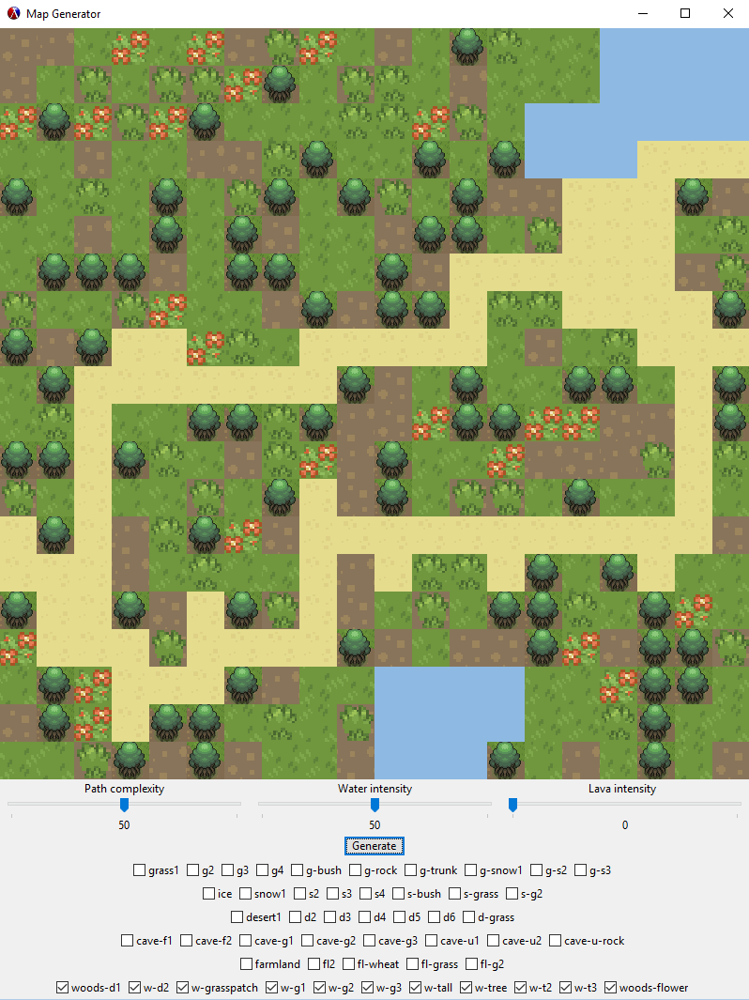

# Random Map Generator

##Authors
Adam Melle
John Perkins

##Overview
Our project is a map generator that generates random game tilemaps. The program allows the user to adjust the chance to generate certain elements of the map. The user can also add new types of terrain on the fly, and choose which terrain they've already included to be used for a generate cycle. The generate button can then be clicked to generate a unique map each time. The maps generated will always have a clear path from the left side to the right, without anything obstructing the path. 

##Screenshot
Here's an example of a randomly generated map.


##Concepts Demonstrated
Adam: I used a lot of recursion in the randomization procedures for the path/water/lava. The randomization procedures also used local state variables that were modified within the procedure during that instance of the procedure call. They were used and modified to keep track of the number of water/lava tiles that could be generated during the recursive procedure. Mutable data was also used a lot in the procedures and for the array. Vectors were constantly being set to different values in order to move around and modify the array. 

John: In the main procedures I made, I used a lot of iterative recursion and specifically for selecting random terrains from a list and just iterates down the list a random amount of times until it gets to the random terrain. There are many places where lists are used in parallel to get objects that were designed to be modular. The prime example is the getValueFromList procedure that looks through a list of checkboxes to get the correct one based off of a label instead of having to create lines of code for those specific objects inside of the code. There are also many cases of mutable data were used such as the number of active terrain types to be used in random generation was kept track of to get correct random numbers without going out of scope. Filter was used as the only higher order procedure to keep the active terrain list clean.

##External Technology and Libraries
racket/gui - Used for the UI and for printing the map to the window. <br>
math/array - Used for the array map.<br>
Everything else was already in the racket language. <br>
Free and modified graphics were used for the map. [Main Source](http://dionen.deviantart.com/art/Biome-Tiles-Public-274422390) <br>

##Favorite Scheme Expressions
####Adam
My favorite procedure, which is the one I'm most proud of, is the genPath procedure. The reason it's my favorite is because it has two functionalities built into the same procedure. Initially, it is used to generate a path by choosing a random point on the left side of the map and then perform a random walk until it reaches the the right side of the map. If the path complexity slider is greater than 0 after the first call to the procedure, it has a chance to recursively call itself, but with the subpath parameter as #t. This causes the procedure to act differently. This time, instead of choosing a starting point on the left side, it targets a random point on the already existing path and then branches off of it until it either hits its tilegen limit, or it reaches the right edge of the map.
```scheme
(define (genPath complexity subpath)
  (begin
    ;;Define variables
    (define pathVector (vector 0 0)) ;Keeps track of current position in the map array
    (define nextx 0) ;Used to hold next step x value
    (define nexty 0) ;Used to hold next step y value
    (define sublength 100)
    (define attempts 200)
    ;;;;;;;;;;;;;;;;;;;;;;
    ;;Branch from path  ;;
    ;;;;;;;;;;;;;;;;;;;;;;
    (define (branchRandom)
      (if(> attempts 0)
         (begin
           (set! attempts (- attempts 1))
           (vector-set! pathVector 0 (random 20))
           (vector-set! pathVector 1 (random 20))
           (if(eq?(array-ref arrayMap (vector (vector-ref pathVector 0) ;Checks if random point is a path tile
                                      (vector-ref pathVector 1))) (getTexture 'path))
              (chooseNext)(branchRandom)))(display "Used every attempt")))
    ;;;;;;;;;;;;;;;;;;;;;;;;;;;;;;;;;;;;;;;;;;;;;;;;;;;;;;;;;;;;;;;;;;;;;;;;;;;;;;;;;
    ;; RANDOM WALK PROCEDURE - Randomly chooses a direction by setting nextx to a  ;;
    ;;                         random number from -1 to 1. -1=Down 0=Right 1=Up.   ;;
    ;;                         If nextx==0, set nexty to 1 in order to move right. ;;
    ;;                         Otherwise nexty is set to 0 to move up or down.     ;;
    ;;;;;;;;;;;;;;;;;;;;;;;;;;;;;;;;;;;;;;;;;;;;;;;;;;;;;;;;;;;;;;;;;;;;;;;;;;;;;;;;;
    (define (chooseNext)
      (if(or(and(equal? subpath #t)(> sublength 0))(equal? subpath #f))
        (begin
          (set! sublength (- sublength 1))
          (set! nextx (- (random 3) 1)) ;Random number from -1 to 1.
          (if(equal? nextx 0) ;If next==0 set nexty to 1, else set nexty to 0.
             (set! nexty 1)(set! nexty 0))
            (if(and(> (+ nextx (vector-ref pathVector 0)) -1) ;Checks if the next step is in bounds
                   (< (+ nextx (vector-ref pathVector 0)) 20)
                   (> (+ nexty (vector-ref pathVector 1)) -1)
                   (< (+ nexty (vector-ref pathVector 1)) 20))
              (if(or(normalTerrain? (array-ref arrayMap (vector (+ nextx (vector-ref pathVector 0)) ;Checks if the next step is empty(contains terrain)
                                                    (+ nexty (vector-ref pathVector 1)))))
                    (and(eq?(array-ref arrayMap (vector (+ nextx (vector-ref pathVector 0)) ;Checks if the next step is a path(this option is for subpaths)
                                                        (+ nexty (vector-ref pathVector 1)))) (getTexture 'path))
                      (equal? subpath #t))) 
                (begin ;If the next step is terrain, Update the current vector position. Set that position in the map array
                       ;to the new path tile. Recrusively call this procedure again if the current position isn't against the right wall. 
                    (vector-set! pathVector 0 (+ nextx (vector-ref pathVector 0)))
                    (vector-set! pathVector 1 (+ nexty (vector-ref pathVector 1)))
                    (array-set! arrayMap pathVector (getTexture 'path))

                    (if(and(not(equal? (vector-ref pathVector 1) 19)))
                      (chooseNext)
                      (display "Generate path done\n")))
             ;If not empty or out of bounds, choose again by recursively calling this procedure.
             (chooseNext))
              (chooseNext)))null))
    ;;;;;;;;;;;;;;
    ;;  DRIVER  ;;
    ;;;;;;;;;;;;;;
    ;;If the call to this procedure is meant to generate a subpath
    (if(and (< (random 120) complexity) (equal? subpath #t))
      (begin
        (branchRandom)
        (genPath complexity #t))null)
    ;Picks a random point on the left edge of the map and places the first path tile.
    (if(equal? subpath #f)
      (begin
        (vector-set! pathVector 0 (random 20))
        (vector-set! pathVector 1 0)
        (array-set! arrayMap pathVector (getTexture 'path))
        ;Generate the rest of the path. chooseNext will recursively call
        ;itself until it reaches the right edge of the map.
        (chooseNext))null)
    ;;If the complexity is > 0 and branch is #f, set branch to #t and recrusively call genpath
    (if(and(> complexity 0)(equal? subpath #f))
       (genPath complexity #t)(display "no subpaths"))))
```
###John
In the end my favorite expression that I made was everything with the checkboxes. Starting out, it seemed very easy, and it would be if I only had to deal with preset terraintypes, i.e. if I only had to deal with grass1 as the only terrain. The challenge came from trying to make it modular enough that an end-user could create a new terrain and have a new random map with their terrain in it.

So it started out simple with only grass, but became complicated as I was trying to make checkboxes without ever naming them and then accessing the values that they held. I came up with the idea to use a list to store and access the checkboxes for each terrain. The actual procedure started extremely complicated, calling a procedure that converted the TerrainList into a list of checkboxes that would then do a bunch of complicated stuff to get working checkboxes. In the end howerver, I figured out how to simplify it to only matter when terrain was made, and to ignore converting the terrainList to a bunch of checkboxes.

In the end, it started out seeming simple, was very complicated for a while there, and finally it actually ended up being very easy. It also holds my favorite small procedure in the entire program where it searched down two lists, one of symbols and one of checkboxes where it searched for a label in the first list and iteractively called itself with both lists being passed through it until it found the value it was looking for. It's an extremely simple procedure, but once I figured out how to do it I was able to make the program 100% modular when it came to adding new terrain types into the program.


``` racket
;; TERRAIN OBJECTS ;;;;;;;;;;;;;;;;;;;;;;;;;;;;;;;;;;;;;;;;;;
; also puts it into the terrain list for randomization
(define (newTerrain tag passable image type)
  (begin
    (putTerrain tag (makeTerrain passable (make-object bitmap% image)))
    (addToTerrainList (list tag))
    (cond ((equal? type 'grass)
           (set! checkBoxList (append checkBoxList  
                                      (list (new check-box%
                                                 (label (symbol->string tag))
                                                 (parent grassPanel)
                                                 (callback (boxesChecked tag))
                                                 (value #f))))))
          ((equal? type 'snow)
           (set! checkBoxList (append checkBoxList  
                                      (list (new check-box%
                                                 (label (symbol->string tag))
                                                 (parent snowPanel)
                                                 (callback (boxesChecked tag))
                                                 (value #f))))))
          ((equal? type 'desert)
           (set! checkBoxList (append checkBoxList  
                                      (list (new check-box%
                                                 (label (symbol->string tag))
                                                 (parent desertPanel)
                                                 (callback (boxesChecked tag))
                                                 (value #f))))))
          ((equal? type 'cave)
           (set! checkBoxList (append checkBoxList  
                                      (list (new check-box%
                                                 (label (symbol->string tag))
                                                 (parent cavePanel)
                                                 (callback (boxesChecked tag))
                                                 (value #f))))))
          ((equal? type 'farmland)
           (set! checkBoxList (append checkBoxList  
                                      (list (new check-box%
                                                 (label (symbol->string tag))
                                                 (parent farmlandPanel)
                                                 (callback (boxesChecked tag))
                                                 (value #f))))))
          ((equal? type 'woods)
           (set! checkBoxList (append checkBoxList  
                                      (list (new check-box%
                                                 (label (symbol->string tag))
                                                 (parent woodsPanel)
                                                 (callback (boxesChecked tag))
                                                 (value #f))))))
    )))
            
            
            
;; ACTIVE TERRAIN ;;;;;;;;;;;;;;;;;;;;;;;;;;;;;;;;;;;;;;;;;
; the procdure that is called whenever a checkbox is ticked
(define (changeActiveList label)
  (let ((currentItem (getValueFromList label)))
    (if (send currentItem get-value) ;;if the value is true, then it's part of the activeterrainlist
        (if (normalTerrain? label)     ;;so if the label is in the list already (uses normal terrain for this), ignore it
            (display 'ok)
            (begin (set! activeTerrainList (append activeTerrainList (list label)))
                   (set! activeTerItems (+ 1 activeTerItems))))        ;;otherwise add it to the list
        (begin (set! activeTerrainList (filter (equal-to-label? label) activeTerrainList))
               (set! activeTerItems (- activeTerItems 1))) ;;if it's not active, remove it fromt the active terrai list with filter
    )))


;; SIMPLE CHECKBOX FINDING ;;;;;;;;;;;;;;;;;;;;;;;;;;;;;;;;;
(define (getValueFromList label)
  (define (g-v-f-l-h listOne listTwo)
    (cond ((equal? '() listOne) #f)
          ((equal? label (car listOne)) (car listTwo))
          (else (g-v-f-l-h (cdr listOne) (cdr listTwo)))))
  (g-v-f-l-h terrainList checkBoxList))
```

#How to Download and Run
The program should run fine in racket as is. Package updates for gui and array should be the only possible conflicts.
